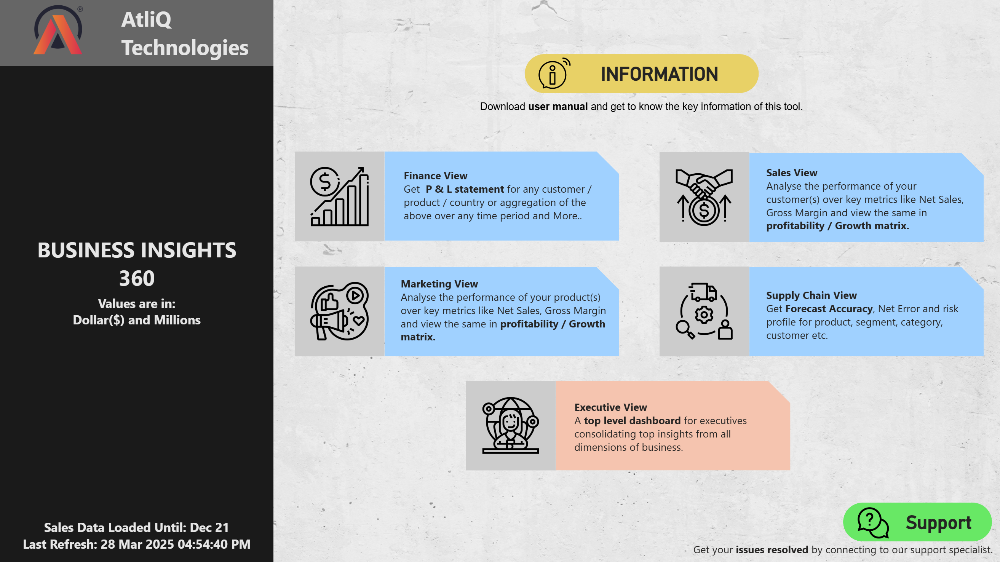
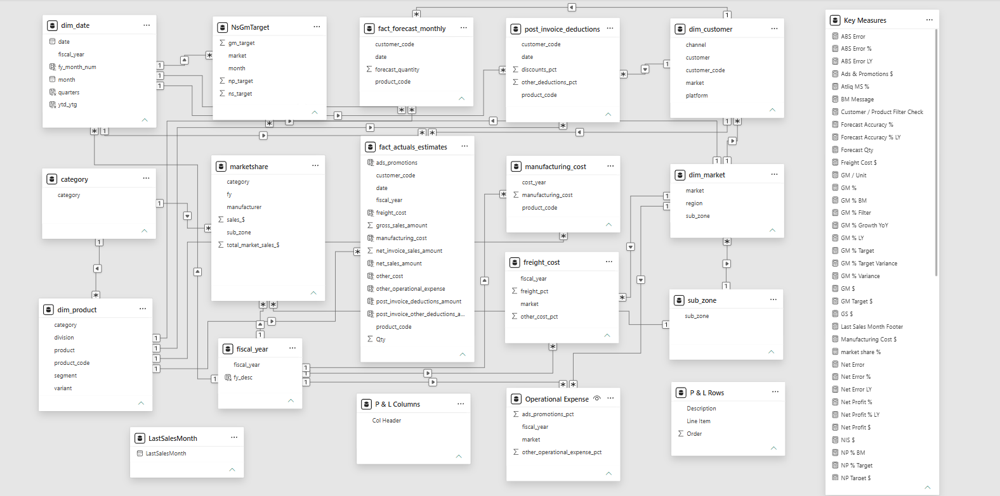
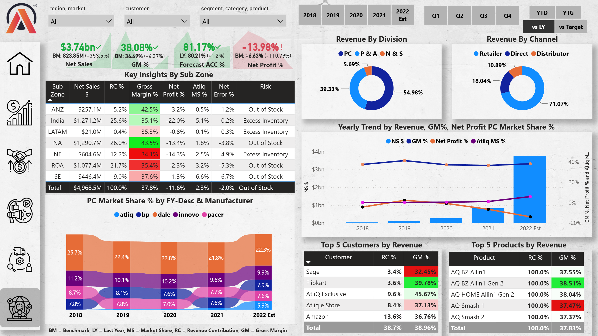
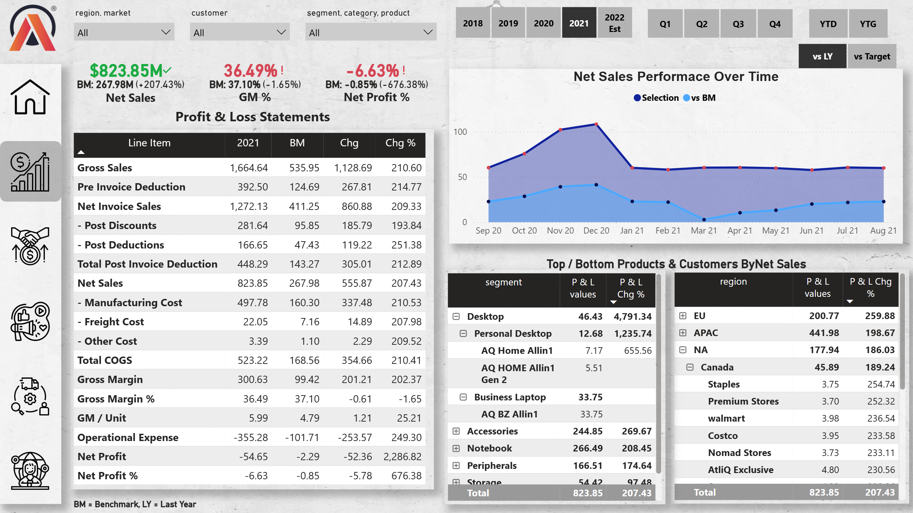
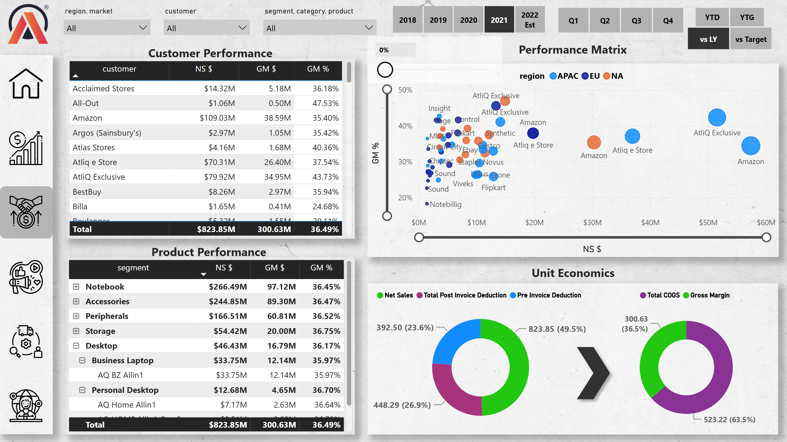
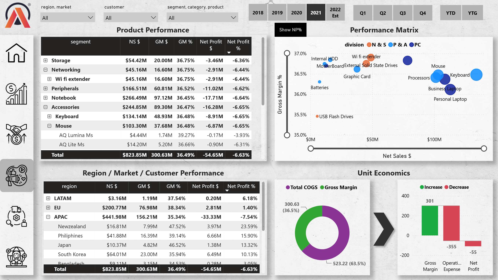
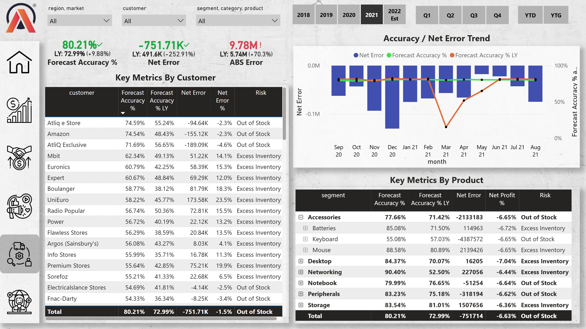
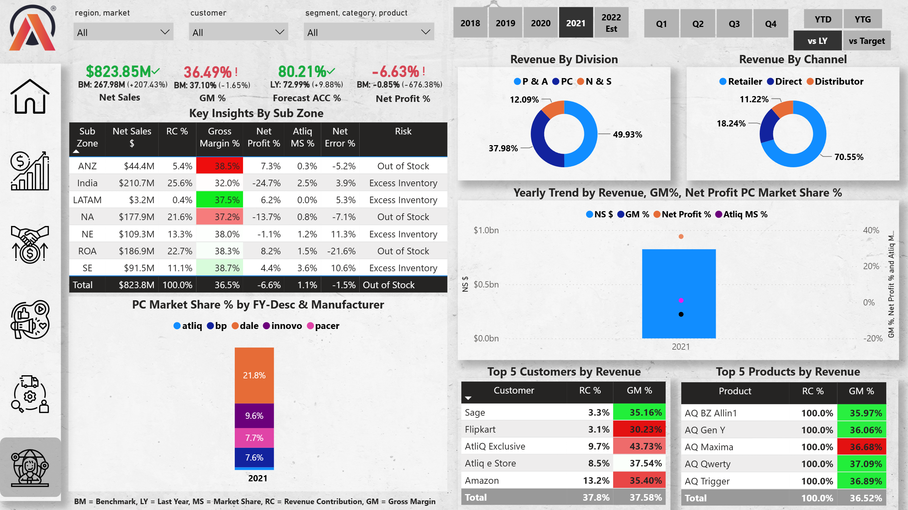
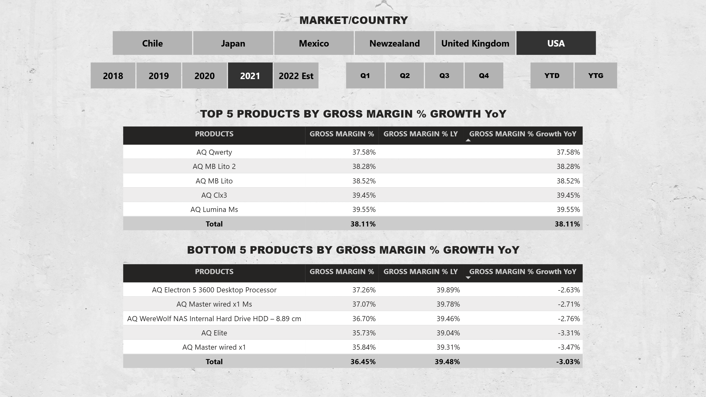

# Business Insights 360 - Enterprise Power BI Dashboard

👉 [Live Interactive Dashboard](https://app.powerbi.com/view?r=eyJrIjoiODQ0MjE0MmEtZDZhZC00NDgzLWIwZGQtODI3NTQzZmY1NmJmIiwidCI6ImM2ZTU0OWIzLTVmNDUtNDAzMi1hYWU5LWQ0MjQ0ZGM1YjJjNCJ9)

📊 [Download Static Dashboard Presentation](docs/Business_Insights_360_Presentation.pdf)

💼 [My Portfolio](https://codebasics.io/portfolio/Harshkumar-Gupta)

🔗 [LinkedIn Profile](https://www.linkedin.com/in/harshkumar-gupta-531034201/)

---

## 📌 Project Objective
Architected an end-to-end Business Intelligence solution to transform fragmented OLTP data into a centralized, scalable analytical foundation. This project equips executives across Finance, Sales, Marketing, and Supply Chain with actionable, data-driven insights to monitor profitability, track market share, and mitigate supply chain risks.

---

### 🏗️ Global Baseline & Architecture Overview

Before isolating specific filtered years, the model establishes a macro-level baseline to evaluate all-time enterprise volume versus bottom-line health.

**1. Centralized User Navigation**
The interface opens with a navigational portal directing stakeholders to functional domains across Finance, Sales, Marketing, Supply Chain, and Executive views.

**2. Data Architecture & Modeling**
The back end runs on a Star Schema connecting high-volume transactional tables (`fact_actuals_estimates`, `fact_forecast_monthly`) with dimension tables (`dim_customer`, `dim_product`, `dim_market`). All business logic is consolidated into a dedicated `Key Measures` table.

**3. Executive Oversight: Macro Baseline Analysis**
Looking at the unfiltered historical overview (`2022 Est` benchmark comparison):
* **Top-Line Scale vs. Profitability:** The enterprise tracks **$3.74B in Net Sales** (+353.5% vs. BM) with a solid **38.08% Gross Margin** (+4.37% vs. BM). However, the business experiences a severe margin collapse at the bottom line, delivering a negative **-13.98% Net Profit %** (-110.79% variance against benchmark).
* **Regional Disparities & Operational Risk:** North America (NA) and India dominate sales volume, generating **$1,290.7M (26.0% RC)** and **$1,271.2M (25.6% RC)** respectively. Despite high revenues, both regions bleed profits: NA posts a **-13.4% Net Profit** with **Out of Stock** risks, while India runs at a **-22.0% Net Profit** accompanied by **Excess Inventory** inefficiencies.
* **Channel & Segment Concentration:** Distribution relies heavily on Retailers (**71.07%**) versus Direct (**18.04%**) and Distributors (**10.89%**). The product mix leans heavily into PC hardware (**54.98%**). Amazon represents the single largest enterprise customer, contributing **13.6% RC** at a **36.76% Gross Margin**.

---

### 🧠 Engineered DAX Logic & Calculations
The reporting suite executes 36 centralized DAX calculations to enforce data governance and dynamic visual behavior across all views:

* **Matrix-Level P&L Disaggregation:** Built a dynamic income statement layout using `SWITCH(TRUE(), ...)` conditioned on `MAX('P & L Rows'[Order])` to toggle between absolute currency metrics ($/M) and margin percentages within a single matrix visual.
* **Supply Chain Risk Classification:** Implemented conditional evaluation logic (`IF([Net Error]>0, "Excess Inventory", IF([Net Error]<0, "Out of Stock", BLANK()))`) to translate raw forecast variance into immediate operational classifications.
* **Dual-Context Benchmarking:** Developed parameter switching via `SELECTEDVALUE('Set BM'[ID])`, providing end-users the choice to dynamically benchmark current metrics against Last Year (`SAMEPERIODLASTYEAR`) or budgetary targets.

📥 **[View the complete DAX Measures Documentation](docs/DAX_Measures.pdf)**

---

### 📊 Fiscal Year 2021 Performance Deep-Dive

Filtering down specifically to **Fiscal Year 2021** eliminates multi-year aggregation noise and isolates an operating environment marked by surging demand offset by rising deductions and variable cost inflation.

#### 1. Finance View (P&L Automation)
* **Deduction Leakage:** Gross Sales of **$1,664.64M** were reduced by **$392.50M** in Pre-Invoice Deductions and **$448.29M** in Total Post-Invoice Deductions, cutting realized Net Sales down to **$823.85M**[cite: 6].
* **Operating Deficit:** Total COGS absorbed **$523.22M** (driven by $497.78M in manufacturing)[cite: 6]. Operational expenses of **-$355.28M** offset the $300.63M Gross Margin, finalizing a **-$54.65M Net Loss** for the fiscal year[cite: 6].

#### 2. Sales View (Customer & Unit Economics)
* **Account Contribution:** Amazon led overall customer volume at **$109.03M Net Sales** and **$38.59M GM** (35.40%)[cite: 7], followed by AtliQ Exclusive at **$79.92M** (43.73% GM)[cite: 7].
* **Unit Margin Composition:** Net Sales comprised 49.5% of total gross value, while Post-Invoice Deductions (26.9%) and Pre-Invoice Deductions (23.6%) eroded top-line intake[cite: 7]. Total COGS accounted for **63.5%** of operational expenditure against a **36.5% Gross Margin**[cite: 7].

#### 3. Marketing View (Regional & Product Viability)
* **Market Deficits:** Despite APAC generating the largest regional Net Sales at **$441.98M**, it produced an overall loss of **-$33.33M (-7.54% Net Profit)**[cite: 8]. Latin America (LATAM) and Europe (EU) maintained positive margins at **6.18%** and **1.40% Net Profit** respectively[cite: 8].
* **Segment Breakdown:** Notebooks led sales volume at **$266.49M** (36.45% GM) but ran at a **-$17.71M Net Loss**[cite: 8].

#### 4. Supply Chain View (Risk Mitigation)
* **Forecast Accuracy:** Global demand forecasting achieved an **80.21% accuracy rate** (up +9.88% YoY from 72.99% LY)[cite: 9].
* **Inventory Exceptions:** Across an Absolute Error of **9.78M units**, physical retail partners (Euronics, Expert, Boulanger) showed systemic **Excess Inventory** errors (+12% to +18% Net Error), whereas key accounts such as Amazon and AtliQ Exclusive experienced **Out of Stock** deficits[cite: 9].

#### 5. Executive View (FY 2021 Performance Summary)
* **Scale vs. Benchmark:** Net Sales achieved **$823.85M** (+207.43% against benchmark), while Gross Margin landed at **36.49%**[cite: 10].
* **Bottom-Line Contraction:** Net Profit settled at **-6.63%** (-676.38% vs. benchmark)[cite: 10]. Regional breakdowns reveal India as the most severely impacted sub-zone, generating **$210.7M in Net Sales** while sinking to a **-24.7% Net Profit** under **Excess Inventory** conditions[cite: 10].
* **Division & Channel Mix:** Retailer channels drove **70.55%** of volume, with the product revenue distribution split between PC (**49.93%**) and Peripherals & Accessories (**37.98%**)[cite: 10].

#### 6. Strategic Ad-Hoc Analysis (Mr. Haryali Task)
* **Product Margin Trajectory:** Isolated top-performing gross margin growers YoY, led by **AQ MB Lito 2** (+38.28% YoY) and **AQ Qwerty** (+37.58% YoY)[cite: 11]. Bottom performers included legacy storage and processing units such as the **AQ Electron 5 3600 Desktop Processor** (-2.63% YoY) and **AQ Master wired x1** (-3.47% YoY)[cite: 11].

---

### 💻 Technical Competencies

* **Tool:** Power BI Desktop / Power BI Service
* **Data Engineering (ETL):** Power Query (M Language)
* **Data Modeling:** Star Schema (Fact & Dimension Tables)
* **Calculations:** Advanced DAX (Data Analysis Expressions)
* **UI/UX Design:** Bookmarks, Page Navigation, Custom Tooltips, Conditional Formatting
